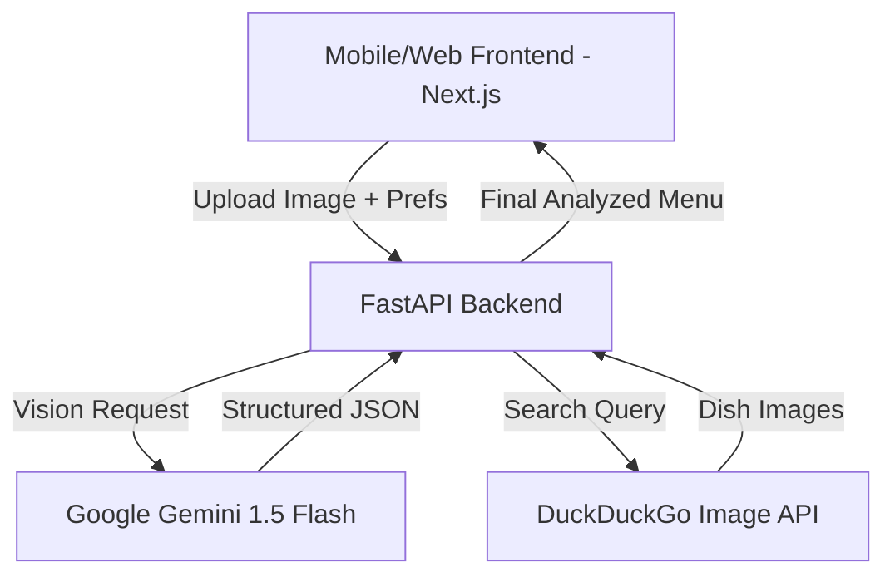

# 🍝 Linguine AI - Intelligent Gastronomy Assistant

[](https://opensource.org/licenses/MIT)
[](https://nextjs.org/)
[](https://fastapi.tiangolo.com/)
[](https://deepmind.google/technologies/gemini/)
[](https://web.dev/glassmorphism/)

**Linguine AI** is a state-of-the-art menu digitizer and personal food assistant designed to bridge the gap between global cuisines and local diners. Whether you're traveling abroad or exploring local ethnic eateries, Linguine AI transforms static, often confusing menu images into an interactive, personalized dining guide.

---

## 🌟 Why Linguine AI?

Dining in a foreign country or a specialized restaurant can be overwhelming. Standard translation apps often miss context, and dietary restrictions are hard to communicate. Linguine AI solves this by:
1. **Contextual Translation**: Not just translating words, but explaining the dish.
2. **Preference Mapping**: Recommendation engine that thinks like you.
3. **Dietary Safety**: Instant flagging of allergens and dietary constraints (Veg/Vegan/Gluten-Free).

---

## ✨ Key Features

### 📸 AI Menu Digitization & Vision
*   **Instant Extraction**: Uses Google Gemini 1.5 Flash to extract dish names, prices, and descriptions from any menu photo.
*   **Vision-Powered Translation**: Context-aware translation of native menu items into English with deep cultural descriptions.

### 🛡️ Smart Personalization
*   **Dietary Guard**: Real-time flagging for `Veg`, `Non-Veg`, `Vegan`, `Gluten-Free`, and custom allergies.
*   **Preference Matching**: Intelligent ranking of dishes based on your preferred **Cuisine**, **Spice Level**, and **Budget Sensitivity**.

### 🎨 Premium User Experience
*   **Glassmorphic Design**: A sleek, modern UI with depth, blur effects, and high-end aesthetics.
*   **Micro-Animations**: Smooth transitions powered by Framer Motion for a "living" interface.
*   **Mobile-First**: Fully responsive design optimized for scanning menus on the go.

### 🤖 Integrated Support
*   **AI Chatbot**: A dedicated support assistant to help you navigate the platform and provide suggestions.

---

## 🏗️ System Architecture

Linguine AI is built with a modularized architecture for speed and scalability:



---

## 🛠️ Tech Stack

### Frontend
- **Framework**: Next.js 14 (App Router)
- **Logic**: TypeScript / React
- **Styling**: Vanilla CSS (Custom Variable System) + Tailwind Concepts
- **Animations**: Framer Motion
- **Icons**: Lucide React

### Backend
- **Framework**: FastAPI (Python 3.10+)
- **AI Model**: Google Gemini 1.5 Flash (Generative AI)
- **Image Search**: DuckDuckGo Search API
- **Processing**: Pydantic for data validation

---

## 🚀 Getting Started

### 📋 Prerequisites
- Node.js (v18+)
- Python (3.10+)
- A Google Gemini API Key ([Get it here](https://aistudio.google.com/))

### Initial Setup
```bash
git clone https://github.com/Arnab02H/CV-Menu-Card-Image.git
cd PERCEPTRON-RKMVERI
```

### 1. Backend Configuration
```bash
cd backend
python -m venv venv
# Windows:
venv\Scripts\activate
# Unix/macOS:
source venv/bin/activate

pip install -r requirements.txt
```
Create a `.env` file in the `backend/` directory:
```env
GOOGLE_API_KEY=your_gemini_api_key_here
```
Run the server:
```bash
python main.py
```

### 2. Frontend Configuration
```bash
cd frontend
npm install
npm run dev
```
Open `http://localhost:3000` to start your dining journey!

---

## 📖 Usage Guide

1.  **Set Your Profile**: Input your Cuisine preferences and Dietary constraints in the Home Command Center.
2.  **Upload Menu**: Take a photo or upload an image of a menu card.
3.  **Analyze**: Let the AI process the image.
4.  **Explore**: 
    *   **Recommended**: See items that perfectly match your profile.
    *   **All Items**: View the full digitized and translated menu.
5.  **Enjoy**: Click on any dish to see a real image of how it looks!

---

## 👨‍💻 About the Developer

**Arnab Bera** is the visionary behind Linguine AI. As a Data Scientist and CMI student, Arnab is passionate about using AI to solve real-world accessibility problems.

*   [LinkedIn Profile](https://www.linkedin.com/in/arnab-bera-65a452229/)
*   [GitHub Portfolio](https://github.com/Arnab02H)

---

## 🤝 Contributing
Contributions are what make the open source community such an amazing place to learn, inspire, and create. Any contributions you make are **greatly appreciated**.

1. Fork the Project
2. Create your Feature Branch (`git checkout -b feature/AmazingFeature`)
3. Commit your Changes (`git commit -m 'Add some AmazingFeature'`)
4. Push to the Branch (`git push origin feature/AmazingFeature`)
5. Open a Pull Request

## 📄 License
Distributed under the MIT License. See `LICENSE` for more information.

---
*Created with ❤️ by Arnab Bera. Bridging cultures through code.*
